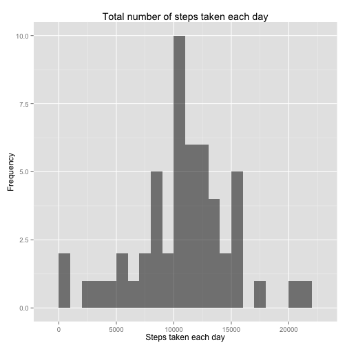
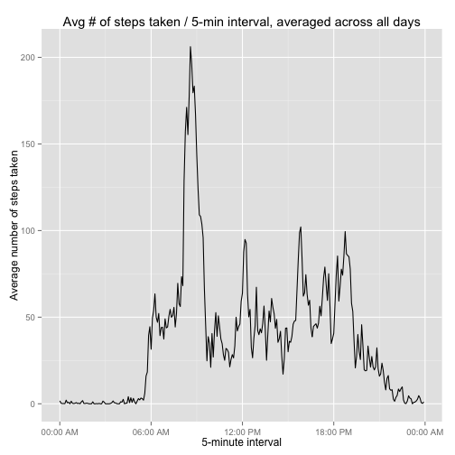
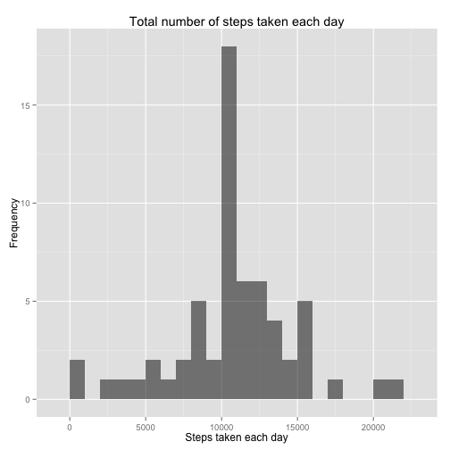
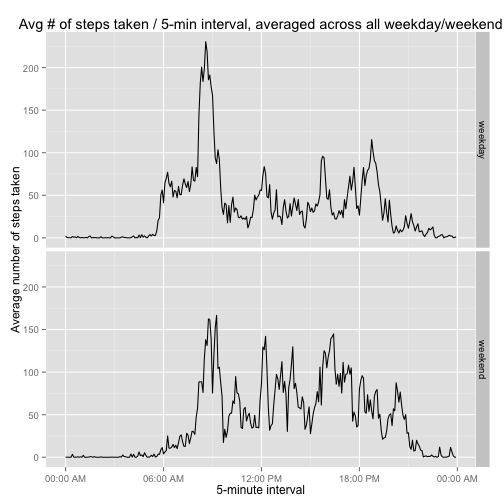

### Loading and preprocessing the data
1. Load the data (i.e. read.csv())

```r
echo = TRUE
activity <- read.csv("~/Desktop/activity.csv")
```

2. Process/transform the data (if necessary) into a format suitable for your analysis.

```r
data <- transform(activity, 
                      datetime = strptime( paste(date,formatC(interval,width=4,flag="0")), "%Y-%m-%d %H%M"),
                      timeofday = strptime( paste("1970-01-01",formatC(interval,width=4,flag="0")), "%Y-%m-%d %H%M"))
```


### What is mean total number of steps taken per day?
1. Calculate the total number of steps taken per day.

```r
steps_per_day <- aggregate( steps ~ date, data=data, FUN=sum)
```

2. If you do not understand the difference between a histogram and a barplot, research the difference between them. Make a histogram of the total number of steps taken each day.

```r
library(ggplot2)
```

```
## Find out what's changed in ggplot2 with
## news(Version == "0.9.3.1", package = "ggplot2")
```

```r
histogram <- function(x) {
    steps_per_day <- aggregate( steps ~ date, data=x, FUN=sum)
    p <- ggplot(steps_per_day, aes(steps))
    p <- p + geom_histogram(binwidth=1000,fill="black",alpha=0.5)
    p <- p + labs(y="Frequency", x="Steps taken each day", title="Total number of steps taken each day")
    print(p)
    steps_per_day
}

steps_per_day <- histogram(data)
```

 

3. Calculate and report the mean and median of the total number of steps taken per day.

```r
mean <- mean(steps_per_day$steps, na.rm=TRUE)
mean
```

```
## [1] 10766.19
```

```r
median <- median(steps_per_day$steps, na.rm=TRUE)
median
```

```
## [1] 10765
```
  
  
### What is the average daily activity pattern?
1. Make a time series plot (i.e. type = "l") of the 5-minute interval (x-axis) and the average number of steps taken, averaged across all days (y-axis).

```r
library(ggplot2)
library(scales)
line_plot <- function(x) {
    avg_steps <- aggregate( steps ~ timeofday , data=x, FUN="mean")
    p <- ggplot(avg_steps, aes(timeofday, steps))
    p <- p + geom_line(color="black")
    p <- p + scale_x_datetime(labels=date_format("%H:%M %p"))
    p <- p + labs(x="5-minute interval", y="Average number of steps taken", title="Avg # of steps taken / 5-min interval, averaged across all days")
    print(p)    
    avg_steps   
}
avg_steps <- line_plot(data)
```

 

2. Which 5-minute interval, on average across all the days in the dataset, contains the maximum number of steps?

```r
max <- avg_steps[which.max(avg_steps$steps),]
max
```

```
##               timeofday    steps
## 104 1970-01-01 08:35:00 206.1698
```
  
  
### Imputing missing values
1. Calculate and report the total number of missing values in the dataset (i.e. the total number of rows with NAs)

```r
missing <- sum(is.na(data$steps))
missing
```

```
## [1] 2304
```

2. Devise a strategy for filling in all of the missing values in the dataset. The strategy does not need to be sophisticated. For example, you could use the mean/median for that day, or the mean for that 5-minute interval, etc.
3. Create a new dataset that is equal to the original dataset but with the missing data filled in.

```r
# Strategy: Replace missing values with the mean value of its 5-minute interval
```


```r
library(dplyr)
```

```
## 
## Attaching package: 'dplyr'
## 
## The following objects are masked from 'package:stats':
## 
##     filter, lag
## 
## The following objects are masked from 'package:base':
## 
##     intersect, setdiff, setequal, union
```

```r
data_noNA <- inner_join(data, avg_steps, by="timeofday")
missing_val <- is.na(data_noNA$steps.x)
data_noNA$steps.x[missing_val] <- data_noNA$steps.y[missing_val]
data_noNA <- transform(data_noNA, steps = steps.x, steps.x=NULL, steps.y=NULL)
```

4. Make a histogram of the total number of steps taken each day and Calculate and report the mean and median total number of steps taken per day. Do these values differ from the estimates from the first part of the assignment? What is the impact of imputing missing data on the estimates of the total daily number of steps?

```r
# The mean and the median found from replacing the missing values with the mean value of it's 5 minute interval are found to be the same as the mean of the number of steps per day.  Both means are found to be the same whereas the median is slightly larger than the median without replacing missing values.  Thus the impact of imputing missing date as the mean of the 5 minute interval causes the distribution of steps to be shifted towards the mean.
```


```r
steps_per_day_noNA <- histogram(data_noNA)
```

 

```r
mean2 <- mean(steps_per_day_noNA$steps)
mean2
```

```
## [1] 10766.19
```

```r
median2 <- median(steps_per_day_noNA$steps)
median2
```

```
## [1] 10766.19
```


### Are there differences in activity patterns between weekdays and weekends?
1. Create a new factor variable in the dataset with two levels – “weekday” and “weekend” indicating whether a given date is a weekday or weekend day.

```r
weekend <- with(data_noNA, ifelse(weekdays(datetime) %in% c("Saturday","Sunday"),"weekend","weekday"))
data_noNA$weekend <- factor(weekend)
steps_weekend <- aggregate(steps ~ weekend + timeofday, data=data_noNA, FUN = "mean")
```

2. Make a panel plot containing a time series plot (i.e. type = "l") of the 5-minute interval (x-axis) and the average number of steps taken, averaged across all weekday days or weekend days (y-axis). See the README file in the GitHub repository to see an example of what this plot should look like using simulated data.

```r
library(ggplot2)
library(scales)
panel <- ggplot(steps_weekend, aes(x=timeofday, y=steps))
panel <- panel + geom_line(col= "black") + facet_grid(weekend~.)
panel <- panel + scale_x_datetime(labels=date_format("%H:%M %p"))
panel <- panel + labs(x="5-minute interval", y="Average number of steps taken", title="Avg # of steps taken / 5-min interval, averaged across all weekday/weekend")
panel
```

 
